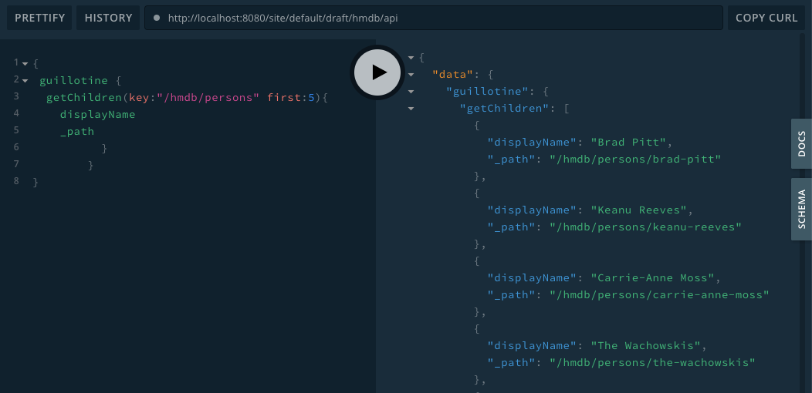

= Headless CMS Starter
:toc: right
:experimental:

Step-by-step tutorial to create and serve content through a GraphQL API

NOTE: This tutorial requires Enonic XP 7.0.0 or later

== Introduction

This tutorial demonstrates how to model, create and serve structured and curated content through a GraphQL API.

NOTE: If you want to build full blown web pages. Check out the guide: https://developer.enonic.com/guides/my-first-site[My first site].

During this tutorial you will learn how to:

* create a new project using the "Headless Starter"
* install and use "Content Studio" for editing content
* customize your application with new content types
* access and use the API

== Create project

To create the project, run the following command:

  enonic project create -r starter-headless

NOTE: *Don't have the Enonic CLI?* Visit the https://developer.enonic.com/start[Getting started guide] to install it.

== Project structure

In the selected folder, you should now have a project structure, looking something like this:

.Selected files from the project structure:
[source,files]
----
src/
 main/
  resources/
   import <1>
   site/ <2>
    content-types/ <3>
    x-data/ <4>
sample/ <5>
----

<1> Sample content for Headless Movie Database
<2> This is where CMS-specific functionality is placed
<3> Content Types are placed in this directory
<4> X-data enables editors to add additional fields to content across different content types
<5> Sample files that will be used in the tutorial

== Building and Deploying

To build and deploy the app, run this command from your shell:

  enonic project deploy

[NOTE]
====
To verify that your app started successfully, you should find an entry similar to this in the sandbox log:

  2019-04-09 13:40:40,765 INFO ... Application [com.enonic.starter.headless] installed successfully
====

== Content Studio

From the admin console (available on http://localhost:8080).

Launch `Content Studio` from the XP menu.

NOTE: *Missing Content Studio?* Open the `Applications` app, choose `Install` and find it in the list of apps that appear.

== Headless Movie Database

Your newly created app includes a sample dataset we call the "Headless Movie Database".
When the app started, it automatically imported the `HMDB` dataset.

image::images/hmdb.png["Headless Movie Database", width="1022px"]

*HMDB* is built from three different content types: `Person`, `Playlist` and `Movie`.
Each content type defines a specific form to edit and publish new items.

=== Person Content Type

Let's have a closer look at the content type "Person".
When creating or editing a Person content, this is what the form looks like in the Content Studio App:

image::images/person.png["Person Form", width="728px"]

The form definition comes from the project file `/src/main/resources/site/content-type/person/person.xml`.

=== eXtra Data

This form also has an additional step for "Social Media" as can be seen below:

image::images/some.png["Social Media form step", width="737px"]

This step is loaded from a so-called eXtra data file (x-data for short).
The file is located in `/src/main/resources/site/x-data/SoMe/SoMe.xml`

The benefit of x-data is that it can be re-used across different content types (even across different apps within the same site).

== Adding a custom content type

To make things even more interesting, we can extend the project with a new content type for reviews.

[cols="1%s,99%a"]
[frame="none"]
[grid="none"]
|============================
|1| *Move the file* `sample/review/review.xml` to `src/main/resources/site/content-types/review/review.xml` in your project.
|2| *Optionally add icon* by moving the file `sample/review/review.svg` to `src/main/resources/site/content-types/review/review.svg` to get a nice icon in Content Studio.
|3| *Build and deploy* your application once more.
|4| *Write A review*. You should now be able to create a "Review" within Content Studio and the *HMDB* site.

image::images/review.png["Sample Review", width="687px"]
|============================

== Accessing the API

NOTE: *New to GraphQL?* Check out the https://graphql.org[GraphQL documentation] after completing this tutorial.

The headless starter uses the the https://market.enonic.com/vendors/enonic/guillotine-headless-lib[Project Guillotine],
to automatically generate a powerful GraphQL API based on available content of the site.

The easiest way to test the API is as follows:

[cols="1%s,99%a"]
[frame="none"]
[grid="none"]
|============================
|1| Install https://github.com/prisma/graphql-playground/releases[GraphQL playground] on your device
|2| Add the following URL: http://localhost:8080/site/default/draft/hmdb/api
|============================

When GraphQL Playground has successfully connected to the service,
the API documentation instantly appears on the right hand side.

The API gives access to the Enonic XP content API and offers strongly typed access to your content.
Queries can now be typed into the left hand panel and executed, with the result in the center panel.

Below are a few examples of queries we can use to access `HMDB`.

== Sample queries

=== Persons

.Get the display name of five items from `persons/``:
[source,GraphQL]
----
{
 guillotine {
  getChildren(key:"/hmdb/persons" first:5){
    displayName
    _path
  	}
	}
}
----

.Sample response:
[source,JSON]
----
{
  "data": {
    "guillotine": {
      "getChildren": [
        {
          "displayName": "Brad Pitt",
          "_path": "/hmdb/persons/brad-pitt"
        },
        {
          "displayName": "Keanu Reeves ",
          "_path": "/hmdb/persons/keanu-reeves"
        },
        {
          "displayName": "Carrie-Anne Moss ",
          "_path": "/hmdb/persons/carrie-anne-moss"
        },
        {
          "displayName": "The Wachowskis",
          "_path": "/hmdb/persons/the-wachowskis"
        },
        {
          "displayName": "Bruce Willis",
          "_path": "/hmdb/persons/bruce-willis"
        }
      ]
    }
  }
}
----

=== Movies and cast

NOTE: Remember to replace `com.example.myapp` and `com_example_myapp` to match the name of your application

.Get display name, and the cast of two movies:
[source,GraphQL]
----
{
  guillotine {
    query(query: "type='com.example.myapp:movie'", first: 2) {
      displayName
      ... on com_example_myapp_Movie {
        data {
          cast {
            actor {
              displayName
            }
            character
          }
        }
      }
    }
  }
}
----

.Sample response
[source,JSON]
----
{
  "data": {
    "guillotine": {
      "query": [
        {
          "displayName": "The Godfather",
          "data": {
            "cast": [
              {
                "actor": {
                  "displayName": "Al Pacino"
                },
                "character": " Michael Corleone"
              }
            ]
          }
        },
        {
          "displayName": "The Shawshank Redemption",
          "data": {
            "cast": [
              {
                "actor": {
                  "displayName": "Tim Robbins"
                },
                "character": "Andy Dufresne"
              },
              {
                "actor": {
                  "displayName": "Morgan Freeman"
                },
                "character": "Ellis Boyd 'Red' Redding"
              },
              {
                "actor": {
                  "displayName": "Bob Gunton"
                },
                "character": "Warden Norton"
              }
            ]
          }
        }
      ]
    }
  }
}
----

=== Person with photo

NOTE: Remember to replace `com.example.myapp` and `com_example_myapp` to match the name of your application

.Name of persons and a link to 400x400 scaled photo
[source,GraphQL]
----
{
  guillotine {
    query(query: "ngram('_allText', 'morgan') AND type='com.example.myapp:person'", first: 6) {
      displayName
      ... on com_example_myapp_Person {
    	  displayName
        data {
          photos(first:1){
            ... on media_Image {
              imageUrl(type:absolute scale:"block(400,400)")
            }

          }
        }
      }
    }
  }
}
----

.Sample response
[source,JSON]
----
{
  "data": {
    "guillotine": {
      "query": [
        {
          "displayName": "Morgan Freeman",
          "data": {
            "photos": [
              {
                "imageUrl": "http://localhost:8080/site/default/draft/hmdb/_/image/7ab1f76a-69a1-490f-b505-6eb6773c7cec:603726cc4fa712aa1b70c7eb64e1349f664494c3/block-400-400/morgan-freeman.jpg"
              }
            ]
          }
        }
      ]
    }
  }
}
----

When deployed to production, all URLs will be aligned with the production domain.

== Creating a site from scratch

So far, we have used the imported content.
To create your own site and content, we can use Content Studio once more.

To create your own site:

[cols="1%s,99%a"]
[frame="none"]
[grid="none"]
|============================
|1| *Click btn:[New]* at a desired location in the structure, and choose the content type "Site".
|2| *Add your application to the site*

image::images/site.png["Add the application to your site", width="544"]

|3| Start creating content within the new site
|============================

TIP: You are completely free to group your content in folders and tree-structures, as well as setting permissions as you desire within the site, just like we do with `HMDB`.

== API setup

The `/api` endpoint is exposed through a controller mapping in the file `src/main/resources/site/site.xml`.
The controller uses underlying functionality provided through a library.
A dependency in the `build.gradle` file, located at your project root ensures that the library is downloaded and built into your app.

=== Customizing API

The Headless API is provided by the https://developer.enonic.com/docs/guillotine-app[Guillotine project].
You may programmatically customize or extend the GraphQL api, as described in the documentation above.

=== CORS headers

Sharing of resources across domains (origins) is known as https://developer.mozilla.org/en-US/docs/Web/HTTP/CORS[CORS].
For security reasons, browsers will prevent POST requests from one domain to another by default.

GraphQL requests are normally POST requests, but our API is configured to allow traffic from any origin through the use of CORS headers.

If you want to limit access to a specific domains, or not at all,
you may do so by customizing the controller file `src/main/resources/controllers/graphql.js`.

== Deploying to Production

To deploy your application to production, your first need a server running Enonic XP.

[NOTE]
====
If you don't already have a server, we recommend trying out https://developer.enonic.com/guides/xp-on-google-cloud-platform[Google Cloud],
or request an instance from the https://enonic.com[Enonic Cloud]. If you are looking for other hosting options, Enonic XP is open source, and capable of running in any cloud or on premises.
====

The easiest way of deploying an app to a server is by uploading it via the `Applications` admin tool.
After building/deploying an application locally, you will find the application file in your project's `build/libs/` folder.
The file is typically called something like: `myproject-1.0.0-SNAPSHOT.jar`.

== Removing HMDB

If you want to use the starter as a template for your real project?
Simply delete the following files and folders from the project structure, and you are good to go:

* `src/main/java*` (Java code used to import the HMDB data)
* `src/main/resources/import*` (the HMDB dataset)
* `src/main/resources/site/content-types/*` (HMDB content types)
* `src/main/resources/site/x-data/*` (X-data form)
* `sample*` (Sample code)
