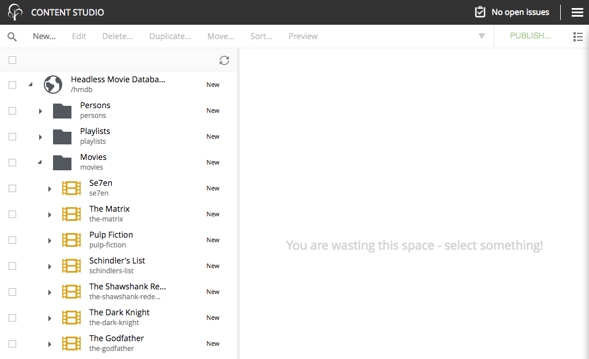
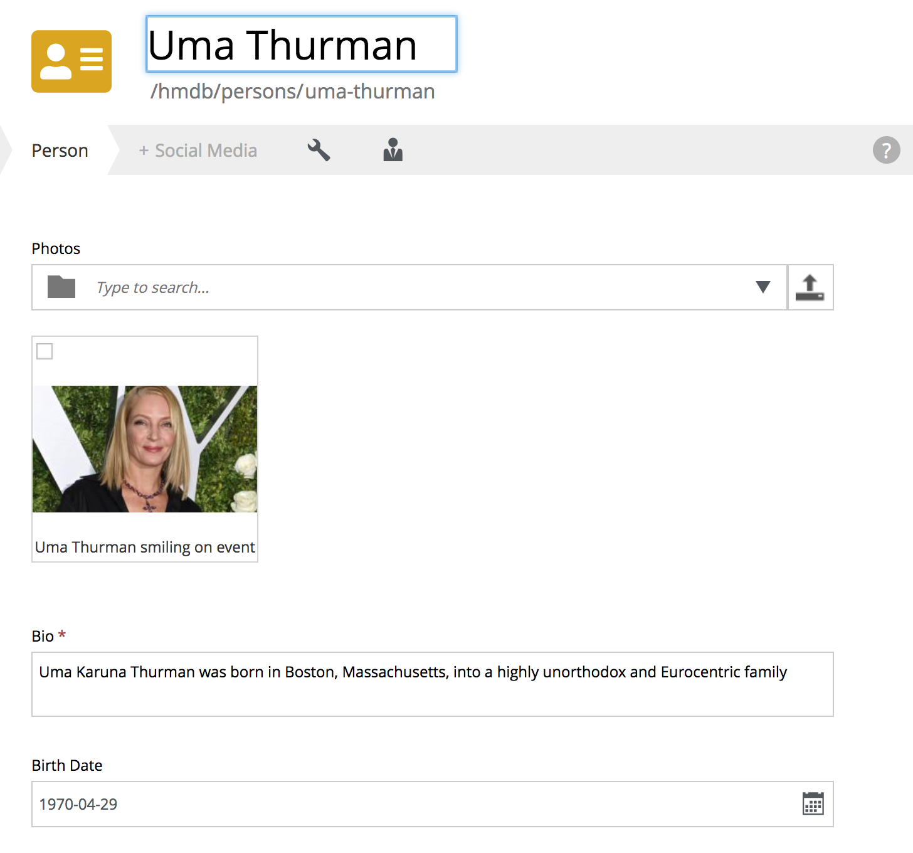
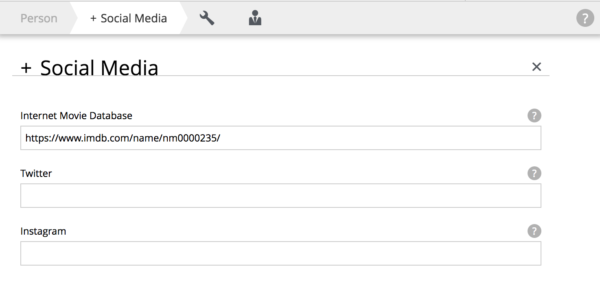
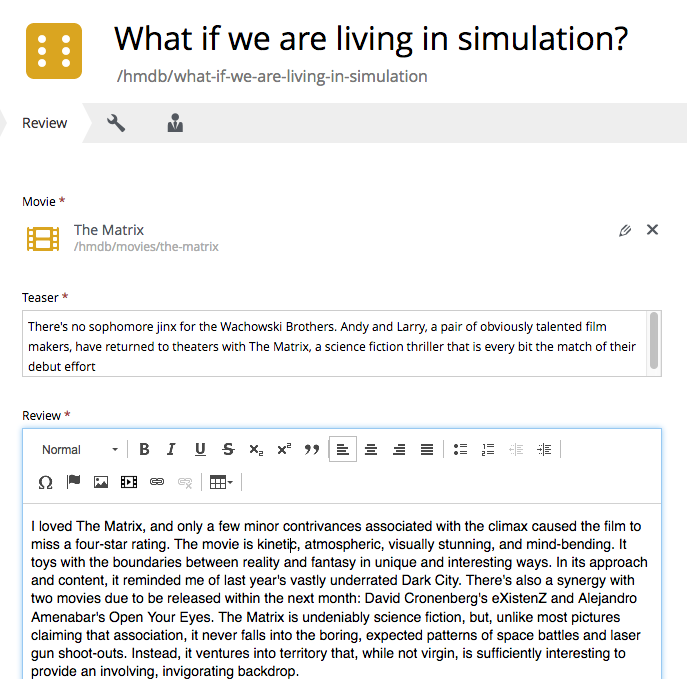
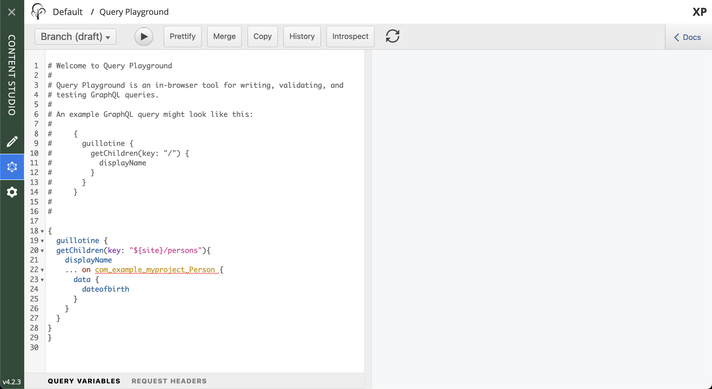
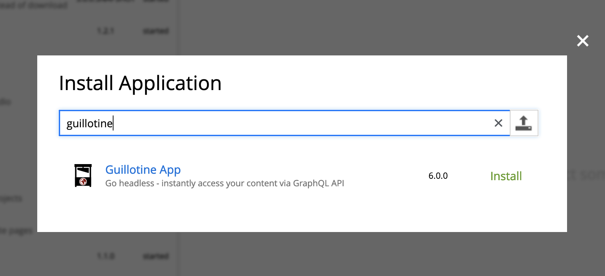
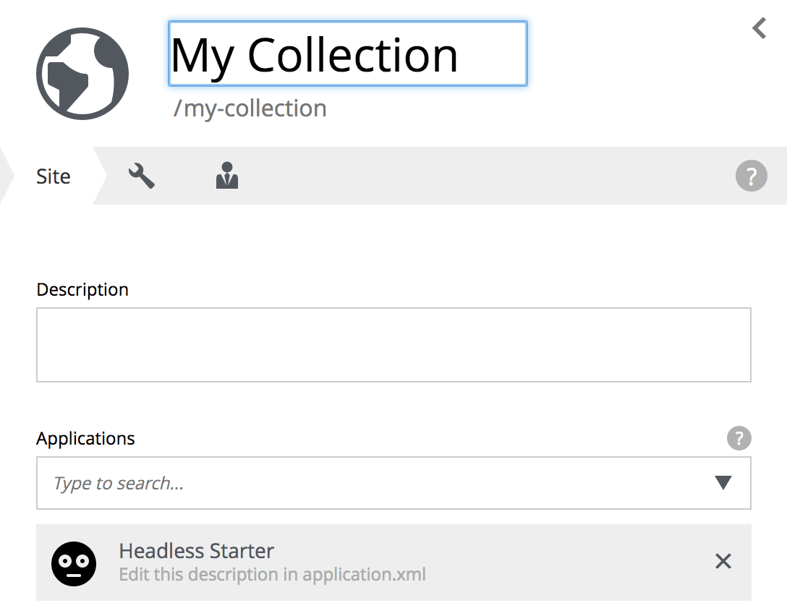

= Headless CMS primer
:toc: right
:experimental:

This is a quick introduction to using Enonic XP and the GraphQL Content API.

NOTE: For a more detailed introduction, check out the https://developer.enonic.com/docs/developer-101[Developer 101 tutorial].

== Introduction

In this tutorial you will learn how to:

* create a new project using a template
* install and use "Content Studio" for editing content
* customize your application with new content types
* reuse schemas across content types (horizontal inheritance)
* access and use the headless API

== Create project

NOTE: *You will need Enonic CLI to complete this step.* Visit the https://developer.enonic.com/start[Quickstart guide] to install it before you continue.

Create your project by running the following command (NB! Go with the standard options)

  enonic project create -r app-hmdb

[TIP]
====
The command uses the https://market.enonic.com/vendors/enonic/headless-movie-db[Headless Movie Data Base] app, aka HMDB as a template for your project.

Drop the "-r app-hmdb" option to see our standard project starters instead.
====

== Project structure

In the target folder, you should now have a project structure, looking something like this:

.Selected files from the project structure:
[source,files]
----
src/
 main/
  resources/
   import <1>
   site/ <2>
    content-types/ <3>
    x-data/ <4>
samples/ <5>
----

<1> Sample content for Headless Movie Database
<2> This is where CMS-specific functionality is placed
<3> Content Types are placed in this directory
<4> X-data enables editors to add additional fields to content across different content types
<5> Sample files that will be used in the tutorial

== Building and Deploying

To build and start the app, run this command:

  enonic project deploy

[NOTE]
====
To verify that your app started successfully, you should find an entry similar to this in the sandbox log:

  2019-04-09 13:40:40,765 INFO ... Application [com.example.myproject] installed successfully
====

[TIP]
====
For the purposes of this guide, you'll build and deploy the app manually for each step. If you want to redeploy changes automatically, you can either run in https://developer.enonic.com/docs/xp/stable/apps/build-system#development_mode[development mode] (which will instantly pickup changes to your files), or use https://developer.enonic.com/docs/xp/stable/apps/build-system#continuous_building[continuous build mode], which will compile and re-deploy the full application. Use the following commands respectively:

  enonic sandbox start --dev
  enonic project gradle deploy --continuous
====

== Content Studio

From the admin console (available on http://localhost:8080).

Launch the editorial interface: `XP menu -> Content Studio`.

NOTE: *No Content Studio?* Install it from `XP menu -> Applications -> Install` and find it in the list of apps that appear.

== Demo content

Your newly created app includes a sample dataset. When the application started, it automatically created a project called `Headless Demo` and imported the `HMDB` dataset into it.

Select this project when prompted, and you will see the demo content, similar to the screenshot below:

NOTE: *HMDB* is consists of four different content types: `Article`, `Person`, `Playlist` and `Movie`.
Each content type defines a specific form to edit and publish new items.

=== Person Content Type

Let's have a closer look at the content type "Person".
When creating or editing a Person content, this is what the form looks like in the Content Studio App:

The form definition comes from the project file `/src/main/resources/site/content-type/person/person.xml`.

=== eXtra Data

This form also has an additional step for "Social Media" as can be seen below:

This step is loaded from a so-called eXtra data file (x-data for short).
The file is located in `/src/main/resources/site/x-data/SoMe/SoMe.xml`

The benefit of x-data is that it can be re-used across different content types (even across different apps within the same site).

== Adding a custom content type

To make things even more interesting, we can extend the project with a new content type for reviews.

. *Move the file* `samples/review/review.xml` to `src/main/resources/site/content-types/review/review.xml` in your project.
. *Optionally add icon* by moving the file `samples/review/review.svg` to `src/main/resources/site/content-types/review/review.svg` to get a nice icon in Content Studio.
. *Build and deploy* your application once more.
. *Write A review*. You should now be able to create a "Review" within Content Studio and the *HMDB* site.
+

== GraphQL API

In Content Studio, you should have a menu item called "Query playground". this interface gives you the ability to test and play with the API.

[NOTE]
====
**No Query playground?** 
Then you need to install the "Guillotine" app: `XP Menu -> Applications -> Install`.

====

Query playground, and the API comes from the Guillotine app. The GraphQL API gives you read-access to all content in your project. 

Queries can be typed into the left hand panel and executed, with the result in the right-hand panel. Docs are available top right.

NOTE: *Want to know more about GraphQL?* After completing the tutorial, feel free to deep dive into the https://graphql.org[official GraphQL documentation].

== Sample queries

Below are a few examples of queries you can use to access the `HMDB` content.

=== Persons

.Get the display name of five items from `persons/` folder:
[source,GraphQL]
----
{
 guillotine {
  getChildren(key:"/hmdb/persons" first:5){
    displayName
    _path
  	}
	}
}
----

.Sample response:
[source,JSON]
----
{
  "data": {
    "guillotine": {
      "getChildren": [
        {
          "displayName": "Brad Pitt",
          "_path": "/hmdb/persons/brad-pitt"
        },
        {
          "displayName": "Keanu Reeves ",
          "_path": "/hmdb/persons/keanu-reeves"
        },
        {
          "displayName": "Carrie-Anne Moss ",
          "_path": "/hmdb/persons/carrie-anne-moss"
        },
        {
          "displayName": "The Wachowskis",
          "_path": "/hmdb/persons/the-wachowskis"
        },
        {
          "displayName": "Bruce Willis",
          "_path": "/hmdb/persons/bruce-willis"
        }
      ]
    }
  }
}
----

=== Query variables

GraphQL supports the concept of query variables. Similar to functions you may "re-use" a query by supplying different variables to it - like parameters.

.The Person query, this time using path as a variable:
[source,GraphQL]
----
query($path:ID!){
 guillotine {
  getChildren(key:$path first:5){
    displayName
    _path
  	}
	}
}
----

The variables are passed to the query using JSON, this may be added to the API browser from the bottom left corner.

[source,JSON]
----
{
    "path": "/hmdb/persons"
}
----

=== Movies and cast

NOTE: Remember to replace `com.example.myproject` and `com_example_myproject` to match the name of your specific application (if you changed the project name during the project init).

.Get display name, and the cast of two movies:
[source,GraphQL]
----
{
  guillotine {
    query(query: "type='com.example.myproject:movie'", first: 2) {
      displayName
      ... on com_example_myproject_Movie {
        data {
          cast {
            actor {
              displayName
            }
            character
          }
        }
      }
    }
  }
}
----

.Sample response
[source,JSON]
----
{
  "data": {
    "guillotine": {
      "query": [
        {
          "displayName": "The Godfather",
          "data": {
            "cast": [
              {
                "actor": {
                  "displayName": "Al Pacino"
                },
                "character": " Michael Corleone"
              }
            ]
          }
        },
        {
          "displayName": "The Shawshank Redemption",
          "data": {
            "cast": [
              {
                "actor": {
                  "displayName": "Tim Robbins"
                },
                "character": "Andy Dufresne"
              },
              {
                "actor": {
                  "displayName": "Morgan Freeman"
                },
                "character": "Ellis Boyd 'Red' Redding"
              },
              {
                "actor": {
                  "displayName": "Bob Gunton"
                },
                "character": "Warden Norton"
              }
            ]
          }
        }
      ]
    }
  }
}
----

=== Person with photo

NOTE: Remember to replace `com.example.myproject` and `com_example_myproject` to match the name of your application

.Name of persons and a link to 400x400 scaled photo
[source,GraphQL]
----
{
  guillotine {
    query(query: "ngram('_allText', 'morgan') AND type='com.example.myproject:person'", first: 6) {
      displayName
      ... on com_example_myproject_Person {
    	  displayName
        data {
          photos(first:1){
            ... on media_Image {
              imageUrl(type:absolute scale:"block(400,400)")
            }

          }
        }
      }
    }
  }
}
----

.Sample response
[source,JSON]
----
{
  "data": {
    "guillotine": {
      "query": [
        {
          "displayName": "Morgan Freeman",
          "data": {
            "photos": [
              {
                "imageUrl": "http://localhost:8080/site/default/draft/hmdb/_/image/7ab1f76a-69a1-490f-b505-6eb6773c7cec:603726cc4fa712aa1b70c7eb64e1349f664494c3/block-400-400/morgan-freeman.jpg"
              }
            ]
          }
        }
      ]
    }
  }
}
----

When deployed to production, all URLs will be aligned with the production domain.

== API endpoint

So far, you've been playing with the API via Content Studio, if you want to access the API's endpoint directly, its available at respectively 

* http://localhost:8080/site/hmdb/draft (Drafts, as seen in Content Studio)
* http://localhost:8080/site/hmdb/master (the published items).

NOTE: The API uses HTTP POST method by default, as such - a regular browser will just show you a 404 on this URLs.

== What are sites?

So far, we have used automatically imported content, the HMDB root item is a site, which is a special content type used to group content.

You may create multiple sites within a project. Try it yourself:

[cols="1%s,99%a"]
[frame="none"]
[grid="none"]
|============================
|1| *Click btn:[New]* at a desired location in the structure, and choose the content type "Site".
|2| *Add your application to the site*

By adding the application to the site, you effectively tell Content Studio that the content types in this app can be used within this site. Apps may also contribute other useful features to the site, such as default preview.

|3| Start creating content within the new site
|============================

TIP: You are completely free to group your content in folders and tree-structures, as well as setting permissions as you desire within the site, just like we do with `HMDB`.

== Deploying to Production

To deploy your application to production, your first need a server running Enonic XP. The steps below will assume you have signed up for a free trial on  https://enonic.com/sign-up/cloud-trial.

[NOTE]
====
If you are looking for other hosting options, Enonic XP is open source, and can be deployed anywhere.
====

. Create a new solution, choose the "CMS essentials" template
. You may now install your app using the CLI
+
  enonic cloud project install
+ 
Or by uploading via UI: `Cloud console -> <My solution> -> Applications -> Install`.
+
The app file can be found in your project i.e. `build/libs/<myproject>.jar`.
+
. Expose your API by creating a new "Route". 
+
Set the internal URL to "/site/hmdb/master" (and make sure you've published your content)
+
. You should now be able to query your published content via the route endpoint.

== Customize your API

The https://developer.enonic.com/docs/guillotine[Guillotine app] exposes a standard API, but you may also embed and customize the API within your own app. 

Get the details from the link above.

Bon voyage!

